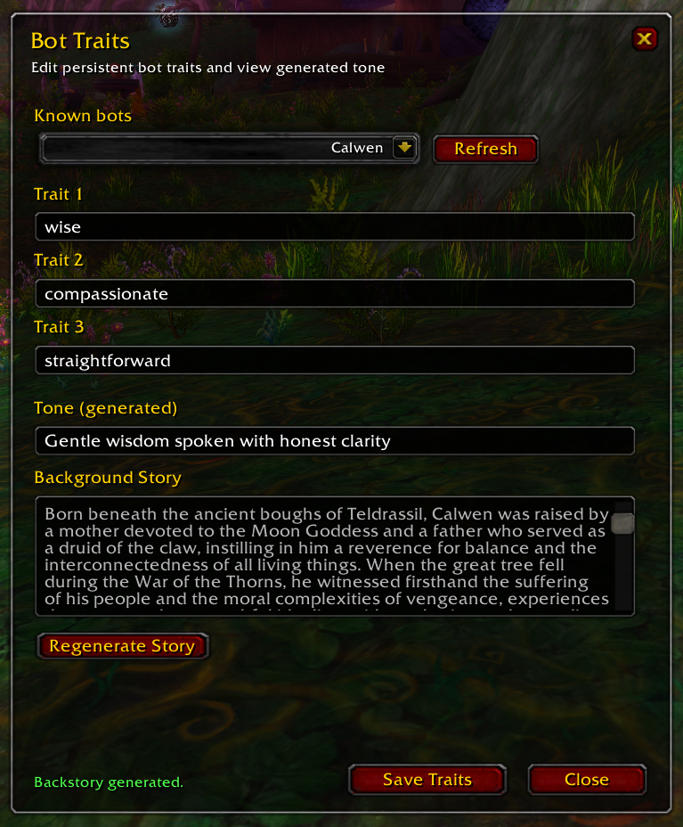



  

# Chatter Companion 

Chatter is a World of Warcraft 3.3.5 addon that acts as a companion UI for the [`mod-llm-chatter`](https://github.com/Hokken/mod-llm-chatter) AzerothCore module.

It lets the player manage persistent personality traits for bots they have grouped with before. The addon shows known bots, allows editing the three stored traits for a selected bot, and displays the tone that `mod-llm-chatter` generates from those traits.

## What It Does

- Lists bots the player has previously grouped with
- Lets the player edit each bot's 3 persistent traits
- Shows the generated tone derived from those traits
- Syncs with the server-side `mod-llm-chatter` data model

## Companion To mod-llm-chatter

This addon is not a standalone system.

It depends on the server-side `mod-llm-chatter` module and its addon command bridge. The addon UI only works if the corresponding `mod-llm-chatter` C++ and Python components are installed, configured, and running on the server.

## Requirements

- AzerothCore with `mod-llm-chatter` installed

## Usage

- Open the addon with `/chatter` or `/llmc`
- Select a known bot from the roster
- Edit the three traits
- Click `Save Changes`
- The server regenerates the tone from the saved traits
- The addon refreshes and displays the generated tone

## Notes

- Tone is generated by the backend and shown in the UI as output
- Bots appear in the roster only after they have been grouped with the player and the server has stored the relevant chatter data
